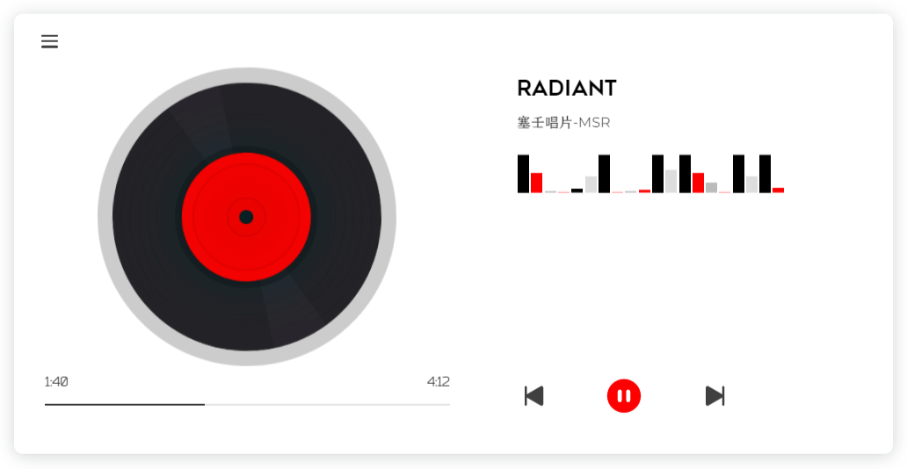
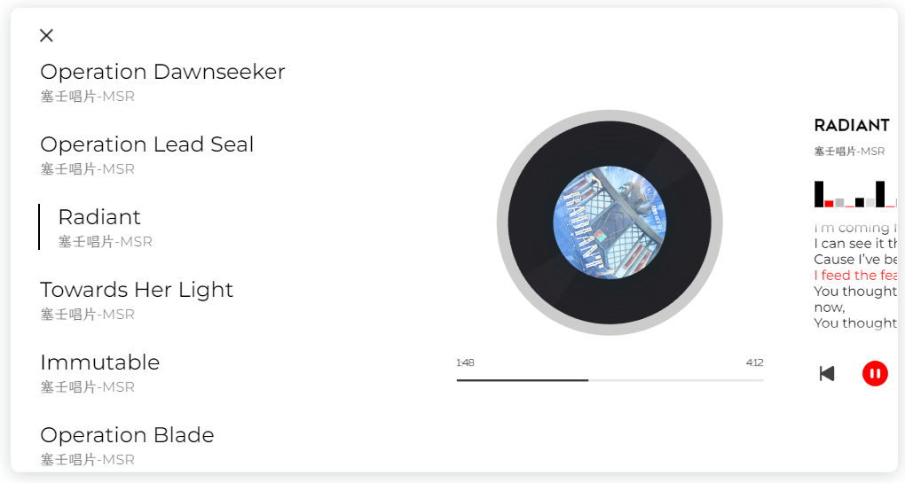

# music-player


[](https://oh-vue-icons.js.org/)


[](https://vercel.com/)

**简约的红黑配色播放器**😇🥰🤗

**A simple music player component by `Vue`**

**All the songs are about `Arknights`**

## **[DEMO](https://music.c01day.com/)**





## Project setup
```
npm install
```

## Compiles and hot-reloads for development
```
npm run serve
```

## Compiles and minifies for production
```
npm run build
```
